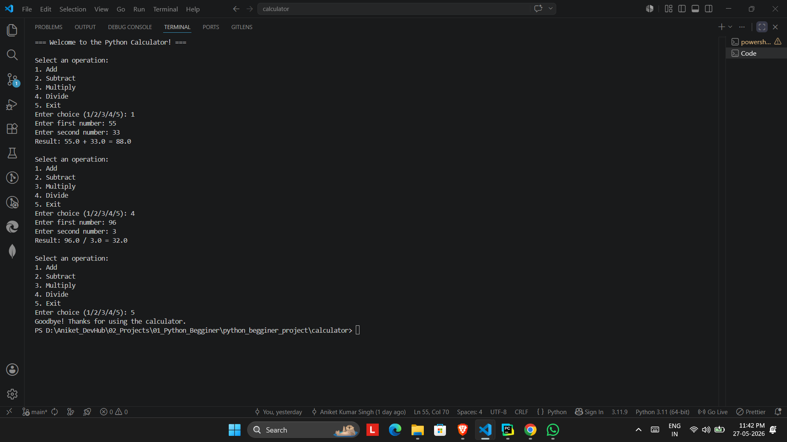

# 🧮 Python Function-Based Calculator

A simple but well-structured calculator built using Python functions with error handling and modular design principles.

---

## 🚀 Features

- Basic arithmetic operations:
  - Addition (+)
  - Subtraction (-)
  - Multiplication (*)
  - Division (/)
- Error handling for invalid inputs
- Division by zero protection
- Modular function-based structure
- Simple command-line interface

---

## 🛠️ Tech Stack

- Python 3.11.9

---

## 📂 Project Structure
```text
calculator/
│
├── assets/
│   └── calculator_demo.png
│
├── main.py
└── README.md
```

---

## 📸 Project Screenshot



---

## ⚙️ How to Run

```bash
python main.py
```

---

## 🧠 What I Learned

- Function-based programming
- Modular code structure
- Error handling using try/except
- Writing clean and maintainable Python code
- Basic Git and GitHub workflow

---

## 📌 Future Improvements

- Add advanced operations
- Create GUI version using Tkinter
- Build web version using Flask
- Add calculation history feature

---

## 👨‍💻 Author

Built as part of my Python development journey while learning backend and software development fundamentals.
```